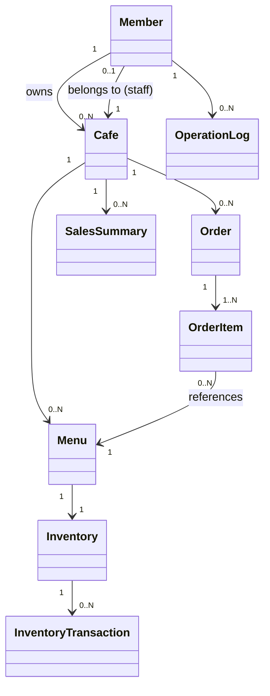

# 03. 도메인 정의 (Domain Model)

본 문서는 [02-requirements.md](./02-requirements.md)의 기능 요구사항을 객체지향 도메인 모델로 구체화한다.

엔티티 설계는 애그리거트(Aggregate) 개념을 참고하여, "누가 어떤 불변조건을 책임지는가"를 기준으로 경계를 나눈다.
풀 DDD를 적용하지는 않지만, 애그리거트 루트를 통해서만 내부 엔티티가 변경되도록 하는 원칙은 따른다.

## 1. 도메인 모델 개요

## 2. 애그리거트 상세

### 2.1 Member (회원)

**Aggregate Root**

| 속성 | 설명 |
|---|---|
| id | PK |
| email | 로그인 식별자, unique |
| password | BCrypt 해시 값 |
| name | 사용자 이름 |
| role | `OWNER`, `STAFF`, `ADMIN` (Enum) |
| cafeId | STAFF인 경우 소속 카페 FK (OWNER/ADMIN은 null) |
| status | `ACTIVE`, `INACTIVE` |
| createdAt | 가입일 |

**책임**
- 인증 정보(이메일/비밀번호) 관리
- 자신의 role에 따른 권한 판단의 근거 제공

**불변조건**
- email은 시스템 전체에서 유일하다.
- password는 평문으로 존재해서는 안 된다(해시 저장).
- role이 `STAFF`이면 cafeId는 null일 수 없다.

> **설계 노트**: Role을 별도 엔티티(Role 테이블)로 분리하는 대신 Enum으로 관리한다. MVP 범위에서는 역할별
> 세분화된 권한 조합(예: "재고만 관리 가능한 STAFF")이 없으므로 Enum이 충분하며, 조합형 권한이 필요해지면
> 별도 `Permission` 테이블로 확장한다.

---

### 2.2 Cafe (카페)

**Aggregate Root**

| 속성 | 설명 |
|---|---|
| id | PK |
| ownerId | 소유자(Member) FK |
| name | 카페 이름 |
| address | 주소 |
| phone | 연락처 |
| businessHours | 영업시간 |
| createdAt | 등록일 |

**책임**
- 카페 기본 정보 관리
- 소속 메뉴/주문/재고의 상위 컨텍스트 제공 (멀티 테넌시 경계)

**불변조건**
- ownerId는 role이 `OWNER`인 Member만 가능하다.

> **설계 노트**: `Cafe`는 이후 모든 도메인(Menu, Order, Inventory, SalesSummary)의 멀티 테넌시
> 경계 역할을 한다. 모든 조회 쿼리는 반드시 cafeId로 스코핑되어야 하며, 이는 다른 카페의 데이터가 노출되지
> 않도록 하는 핵심 보안 규칙이다.

---

### 2.3 Menu (메뉴)

**Aggregate Root**

| 속성 | 설명 |
|---|---|
| id | PK |
| cafeId | 소속 카페 FK |
| name | 메뉴 이름 |
| price | 가격 |
| description | 설명 |
| status | `ON_SALE`, `SOLD_OUT`, `DELETED` |
| createdAt | 등록일 |

**책임**
- 메뉴 기본 정보 관리
- 재고 상태에 따른 판매 가능 여부 노출

**불변조건**
- price는 0보다 커야 한다.
- 삭제는 물리 삭제가 아닌 상태 변경(`DELETED`)으로 처리한다 (주문 이력 참조 무결성 보존).

---

### 2.4 Inventory (재고)

**Aggregate Root**

| 속성 | 설명 |
|---|---|
| id | PK |
| menuId | 연결된 메뉴 FK (1:1) |
| quantity | 현재 재고 수량 |
| thresholdQuantity | 부족 알림 기준 수량 |
| updatedAt | 최종 갱신 시각 |

**내부 엔티티: InventoryTransaction (재고 변동 이력)**

| 속성 | 설명 |
|---|---|
| id | PK |
| inventoryId | 소속 재고 FK |
| changeType | `IN`(입고), `OUT`(차감) |
| quantityChanged | 변동 수량 |
| reason | `ORDER`, `MANUAL_RESTOCK` |
| createdAt | 발생 시각 |

**책임**
- 재고 차감/보충 시 수량 검증 및 변경
- 재고 부족 여부 판단 (quantity ≤ thresholdQuantity)
- 모든 변동 이력을 `InventoryTransaction`으로 기록

**불변조건**
- quantity는 음수가 될 수 없다 (차감 시 검증, 부족하면 예외 발생).
- 모든 quantity 변경은 InventoryTransaction 기록을 동반한다.

> **설계 노트**: MVP에서는 메뉴 단위 1:1 재고로 단순화한다. 실제로는 여러 메뉴가 동일 원재료(예: 우유)를
> 공유하는 원재료 단위 재고가 더 현실적이지만, 이는 도메인 복잡도를 크게 높이므로 Out of Scope로 두고
> 향후 확장 포인트로 관리한다.
>
> **동시성 처리**: 재고 차감은 동시 주문 시 race condition이 발생할 수 있는 지점이다. 구현 단계에서
> JPA `@Version`을 이용한 낙관적 락(Optimistic Lock) 적용을 기본 전략으로 하고, 충돌 빈도가 높다고
> 판단되면 비관적 락으로 전환한다. 상세 구현 방식은 개발 단계에서 결정한다.

---

### 2.5 Order (주문)

**Aggregate Root**

| 속성 | 설명 |
|---|---|
| id | PK |
| cafeId | 소속 카페 FK |
| memberId | 주문을 처리한 직원/사장 FK |
| status | `RECEIVED`, `IN_PROGRESS`, `COMPLETED`, `CANCELED` |
| totalAmount | 총 주문 금액 |
| createdAt | 주문 생성 시각 |

**내부 엔티티: OrderItem**

| 속성 | 설명 |
|---|---|
| id | PK |
| orderId | 소속 주문 FK |
| menuId | 참조 메뉴 FK |
| menuNameSnapshot | 주문 시점 메뉴 이름 (스냅샷) |
| priceSnapshot | 주문 시점 가격 (스냅샷) |
| quantity | 주문 수량 |
| subtotal | 소계 (priceSnapshot × quantity) |

**책임**
- 주문 항목 구성 및 총액 계산
- 상태 전이 규칙 검증
- OrderItem은 Order를 통해서만 생성/변경 (애그리거트 루트 원칙)

**불변조건**
- OrderItem은 최소 1개 이상 존재해야 한다.
- 상태 전이는 `RECEIVED → IN_PROGRESS → COMPLETED` 또는 `RECEIVED/IN_PROGRESS → CANCELED` 순서만 허용한다.

> **설계 노트**: 메뉴 이름/가격을 스냅샷으로 저장하는 이유는, 이후 메뉴 가격이 변경되거나 메뉴가 삭제되어도
> 과거 주문 내역 및 매출 집계가 왜곡되지 않도록 하기 위함이다. 이는 실무에서 흔히 사용하는 패턴이다.

---

### 2.6 SalesSummary (매출 집계)

**Aggregate Root** (파생 데이터)

| 속성 | 설명 |
|---|---|
| id | PK |
| cafeId | 소속 카페 FK |
| summaryDate | 집계 기준 날짜 |
| totalSales | 해당일 총 매출 |
| totalOrderCount | 해당일 총 주문 수 |
| createdAt | 집계 생성 시각 |

**책임**
- Scheduler에 의해 매일 생성/갱신되는 일별 집계 스냅샷 제공

> **설계 노트**: `SalesSummary`는 `Order`로부터 파생된 캐시성 데이터이며 Source of Truth가 아니다.
> 매번 실시간 집계 쿼리를 돌리는 대신, 스케줄러가 하루 단위로 미리 집계해두어 통계 조회 API의 응답 속도를
> 개선한다. 월별 통계는 일별 데이터를 합산해 계산한다.

---

### 2.7 OperationLog (운영 로그)

**Aggregate Root**

| 속성 | 설명 |
|---|---|
| id | PK |
| actorId | 행위자(Member) FK |
| action | 수행한 작업 (예: `ORDER_STATUS_CHANGE`, `MEMBER_DEACTIVATE`) |
| targetType | 대상 리소스 타입 |
| targetId | 대상 리소스 ID |
| createdAt | 발생 시각 |

**책임**
- 관리자(FR-ADMIN-03)가 조회할 수 있는 시스템 운영 이력 기록

---

## 3. 애그리거트 간 관계 요약

| 관계 | 종류 | 설명 |
|---|---|---|
| Member(Owner) → Cafe | 1 : N | 한 사장이 여러 카페를 소유할 수 있다. |
| Member(Staff) → Cafe | N : 1 | 직원은 하나의 카페에 소속된다. |
| Cafe → Menu | 1 : N | 카페는 여러 메뉴를 가진다. |
| Menu → Inventory | 1 : 1 | 메뉴별로 하나의 재고를 가진다 (MVP 단순화). |
| Inventory → InventoryTransaction | 1 : N | 재고 변동 이력이 누적된다. |
| Cafe → Order | 1 : N | 카페 단위로 주문이 발생한다. |
| Order → OrderItem | 1 : N | 하나의 주문은 여러 항목을 가진다. |
| OrderItem → Menu | N : 1 | 주문 항목은 메뉴를 참조하지만 가격/이름은 스냅샷으로 보존한다. |
| Cafe → SalesSummary | 1 : N | 카페별 일별 매출 집계가 누적된다. |

---

## 4. 도메인 서비스 vs 엔티티 책임 배분

객체지향 설계 원칙에 따라, 단일 엔티티의 불변조건은 엔티티 스스로 지키게 하고,
여러 애그리거트에 걸친 조율(orchestration)은 Application Service가 담당한다.

| 로직 | 담당 |
|---|---|
| 재고 수량이 음수가 되지 않도록 검증 | `Inventory.decrease(quantity)` (엔티티 메서드) |
| 주문 상태 전이 규칙 검증 | `Order.changeStatus(newStatus)` (엔티티 메서드) |
| 주문 생성 시 여러 메뉴의 재고를 동시에 차감하고 실패 시 롤백 | `OrderService` (Application Service) |
| 재고 부족 감지 후 이벤트 발행 | `InventoryService` + 이벤트 발행 |
| 일별 매출 집계 생성 | `SalesSummaryService` + Scheduler |

이 원칙에 따라 엔티티가 스스로를 보호하는 Rich Domain Model을 지향하며,
Service 계층이 단순히 Repository를 호출하는 절차적 코드로 전락하지 않도록 한다.

---

## 5. 다음 단계와의 연결

- 위 엔티티와 속성은 `04-erd.md`에서 실제 테이블, 컬럼 타입, 인덱스, FK 제약으로 구체화된다.
- 애그리거트 루트 단위는 `05-api-spec.md`의 리소스(Resource) 단위와 대응된다.
- 동시성 제어(낙관적 락)와 이벤트 발행 지점은 `06-architecture.md`에서 구체적인 기술 방식으로 다룬다.
