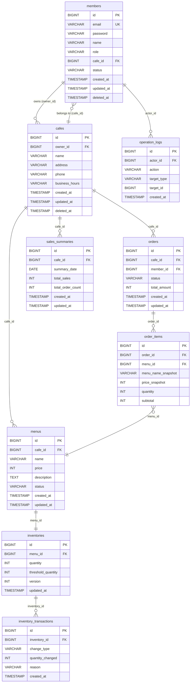

# 04. ERD (Entity Relationship Diagram)

본 문서는 [03-domain.md](./03-domain.md)에서 정의한 도메인 모델을 실제 PostgreSQL 테이블 설계로 구체화한다.

## 1. 공통 설계 원칙

| 항목 | 결정 | 근거 |
|---|---|---|
| PK 타입 | `BIGINT GENERATED ALWAYS AS IDENTITY` | 성능과 단순성 면에서 UUID보다 유리. JPA `@GeneratedValue(IDENTITY)` 전략과 자동 연동된다. |
| Audit 컬럼 | 모든 테이블에 `created_at`, `updated_at` 공통 적용 | JPA `@MappedSuperclass` 기반 `BaseEntity`로 공통 처리 |
| Soft Delete | `deleted_at TIMESTAMP NULL` 컬럼 방식 | 삭제 시각 보존 가능, JPA `@SQLRestriction`으로 자동 필터링 |
| 문자셋 | UTF-8 (PostgreSQL 기본값) | 별도 설정 불필요. 이모지 포함 한글 처리 |
| 시간대 | `TIMESTAMP` + 애플리케이션 레벨 UTC 관리 | PostgreSQL `TIMESTAMP`는 MySQL `DATETIME`에 대응하며 2038 문제 없음 |
| ENUM 타입 | `VARCHAR` + 애플리케이션 레벨 검증 | PostgreSQL 네이티브 ENUM은 DDL 변경이 번거롭다. JPA `@Enumerated(EnumType.STRING)`이 VARCHAR로 자동 매핑되므로 VARCHAR 사용 |

---

## 2. ERD 다이어그램

---

## 3. 테이블 상세 정의

### 3.1 members

| 컬럼명 | 타입 | 제약 | 설명 |
|---|---|---|---|
| id | BIGINT | PK, GENERATED ALWAYS AS IDENTITY | |
| email | VARCHAR(100) | UNIQUE, NOT NULL | 로그인 식별자 |
| password | VARCHAR(255) | NOT NULL | BCrypt 해시 값 |
| name | VARCHAR(50) | NOT NULL | 사용자 이름 |
| role | VARCHAR(20) | NOT NULL | 권한 역할 (`OWNER`, `STAFF`, `ADMIN`) |
| cafe_id | BIGINT | FK(cafes.id), NULL | STAFF 소속 카페 (OWNER/ADMIN은 NULL) |
| status | VARCHAR(20) | NOT NULL, DEFAULT 'ACTIVE' | 계정 활성 상태 (`ACTIVE`, `INACTIVE`) |
| created_at | TIMESTAMP | NOT NULL | |
| updated_at | TIMESTAMP | NOT NULL | |
| deleted_at | TIMESTAMP | NULL | Soft Delete |

**인덱스**
- `UK_members_email` UNIQUE (email)
- `IDX_members_cafe_id` (cafe_id) — Staff 소속 조회

---

### 3.2 cafes

| 컬럼명 | 타입 | 제약 | 설명 |
|---|---|---|---|
| id | BIGINT | PK, GENERATED ALWAYS AS IDENTITY | |
| owner_id | BIGINT | FK(members.id), NOT NULL | 소유자 |
| name | VARCHAR(100) | NOT NULL | 카페 이름 |
| address | VARCHAR(255) | NOT NULL | 주소 |
| phone | VARCHAR(20) | NULL | 연락처 |
| business_hours | VARCHAR(100) | NULL | 영업시간 (예: "09:00-21:00") |
| created_at | TIMESTAMP | NOT NULL | |
| updated_at | TIMESTAMP | NOT NULL | |
| deleted_at | TIMESTAMP | NULL | Soft Delete |

**인덱스**
- `IDX_cafes_owner_id` (owner_id) — 사장 본인 카페 목록 조회

---

### 3.3 menus

| 컬럼명 | 타입 | 제약 | 설명 |
|---|---|---|---|
| id | BIGINT | PK, GENERATED ALWAYS AS IDENTITY | |
| cafe_id | BIGINT | FK(cafes.id), NOT NULL | 소속 카페 |
| name | VARCHAR(100) | NOT NULL | 메뉴 이름 |
| price | INT | NOT NULL | 가격 (원 단위, 0 초과) |
| description | TEXT | NULL | 설명 |
| status | VARCHAR(20) | NOT NULL, DEFAULT 'ON_SALE' | 판매 상태 (`ON_SALE`, `SOLD_OUT`, `DELETED`) |
| created_at | TIMESTAMP | NOT NULL | |
| updated_at | TIMESTAMP | NOT NULL | |

> Soft Delete를 `status = 'DELETED'`로 처리하므로 `deleted_at` 컬럼 불필요.
> 단, 삭제 시각이 필요하다고 판단되면 `deleted_at` 추가를 검토한다.

**인덱스**
- `IDX_menus_cafe_id` (cafe_id) — 카페별 메뉴 목록 조회

---

### 3.4 inventories

| 컬럼명 | 타입 | 제약 | 설명 |
|---|---|---|---|
| id | BIGINT | PK, GENERATED ALWAYS AS IDENTITY | |
| menu_id | BIGINT | FK(menus.id), UNIQUE, NOT NULL | 연결 메뉴 (1:1) |
| quantity | INT | NOT NULL, DEFAULT 0 | 현재 재고 수량 (0 이상) |
| threshold_quantity | INT | NOT NULL, DEFAULT 5 | 부족 알림 기준 수량 |
| version | INT | NOT NULL, DEFAULT 0 | 낙관적 락용 버전 컬럼 |
| updated_at | TIMESTAMP | NOT NULL | |

> `version` 컬럼은 JPA `@Version`과 연동하여 동시 차감 시 충돌을 감지한다.
> `created_at`은 Menu 생성 시점과 동일하므로 별도 저장하지 않는다.

**인덱스**
- `UK_inventories_menu_id` UNIQUE (menu_id) — 1:1 보장

---

### 3.5 inventory_transactions

| 컬럼명 | 타입 | 제약 | 설명 |
|---|---|---|---|
| id | BIGINT | PK, GENERATED ALWAYS AS IDENTITY | |
| inventory_id | BIGINT | FK(inventories.id), NOT NULL | 소속 재고 |
| change_type | VARCHAR(10) | NOT NULL | 입고/차감 구분 (`IN`, `OUT`) |
| quantity_changed | INT | NOT NULL | 변동 수량 (양수) |
| reason | VARCHAR(30) | NOT NULL | 변동 사유 (`ORDER`, `MANUAL_RESTOCK`) |
| created_at | TIMESTAMP | NOT NULL | 발생 시각 |

**인덱스**
- `IDX_inv_tx_inventory_id` (inventory_id) — 재고별 이력 조회
- `IDX_inv_tx_created_at` (created_at) — 기간별 이력 조회

---

### 3.6 orders

| 컬럼명 | 타입 | 제약 | 설명 |
|---|---|---|---|
| id | BIGINT | PK, GENERATED ALWAYS AS IDENTITY | |
| cafe_id | BIGINT | FK(cafes.id), NOT NULL | 소속 카페 |
| member_id | BIGINT | FK(members.id), NOT NULL | 처리 직원/사장 |
| status | VARCHAR(20) | NOT NULL, DEFAULT 'RECEIVED' | 주문 상태 (`RECEIVED`, `IN_PROGRESS`, `COMPLETED`, `CANCELED`) |
| total_amount | INT | NOT NULL | 총 주문 금액 |
| created_at | TIMESTAMP | NOT NULL | |
| updated_at | TIMESTAMP | NOT NULL | |

**인덱스**
- `IDX_orders_cafe_id` (cafe_id) — 카페별 주문 목록 조회
- `IDX_orders_cafe_id_created_at` (cafe_id, created_at) — 카페별 기간 주문 조회 (매출 집계)
- `IDX_orders_status` (status) — 상태별 필터링

---

### 3.7 order_items

| 컬럼명 | 타입 | 제약 | 설명 |
|---|---|---|---|
| id | BIGINT | PK, GENERATED ALWAYS AS IDENTITY | |
| order_id | BIGINT | FK(orders.id), NOT NULL | 소속 주문 |
| menu_id | BIGINT | FK(menus.id), NOT NULL | 참조 메뉴 |
| menu_name_snapshot | VARCHAR(100) | NOT NULL | 주문 시점 메뉴 이름 스냅샷 |
| price_snapshot | INT | NOT NULL | 주문 시점 가격 스냅샷 |
| quantity | INT | NOT NULL | 주문 수량 (1 이상) |
| subtotal | INT | NOT NULL | price_snapshot × quantity |

> `order_items`는 `orders`의 내부 엔티티이므로 `created_at`, `updated_at` 별도 관리하지 않는다.
> 이력 보존이 필요한 시점(가격/이름)은 스냅샷 컬럼이 담당한다.

**인덱스**
- `IDX_order_items_order_id` (order_id)
- `IDX_order_items_menu_id` (menu_id) — 메뉴별 판매량 집계 (인기 메뉴 분석)

---

### 3.8 sales_summaries

| 컬럼명 | 타입 | 제약 | 설명 |
|---|---|---|---|
| id | BIGINT | PK, GENERATED ALWAYS AS IDENTITY | |
| cafe_id | BIGINT | FK(cafes.id), NOT NULL | 소속 카페 |
| summary_date | DATE | NOT NULL | 집계 기준 날짜 |
| total_sales | INT | NOT NULL | 해당일 총 매출 |
| total_order_count | INT | NOT NULL | 해당일 총 주문 수 |
| created_at | TIMESTAMP | NOT NULL | |
| updated_at | TIMESTAMP | NOT NULL | |

**인덱스**
- `UK_sales_summaries_cafe_date` UNIQUE (cafe_id, summary_date) — 카페별 날짜 중복 방지
- `IDX_sales_summaries_cafe_id_date` (cafe_id, summary_date) — 기간 매출 조회

---

### 3.9 operation_logs

| 컬럼명 | 타입 | 제약 | 설명 |
|---|---|---|---|
| id | BIGINT | PK, GENERATED ALWAYS AS IDENTITY | |
| actor_id | BIGINT | FK(members.id), NOT NULL | 행위자 |
| action | VARCHAR(100) | NOT NULL | 수행 작업 (예: ORDER_STATUS_CHANGE) |
| target_type | VARCHAR(50) | NULL | 대상 리소스 타입 (예: ORDER) |
| target_id | BIGINT | NULL | 대상 리소스 ID |
| created_at | TIMESTAMP | NOT NULL | 발생 시각 |

**인덱스**
- `IDX_op_logs_actor_id` (actor_id)
- `IDX_op_logs_created_at` (created_at) — 기간별 로그 조회

---

## 4. 인덱스 설계 근거 요약

| 인덱스 | 사유 |
|---|---|
| `members.email` UNIQUE | 로그인 시 email 조회, 중복 가입 방지 |
| `orders.(cafe_id, created_at)` | 카페별 기간 주문 조회 — 매출 집계의 핵심 쿼리 |
| `order_items.menu_id` | 메뉴별 판매량 집계 — 인기 메뉴 분석 쿼리 |
| `sales_summaries.(cafe_id, summary_date)` UNIQUE | 일별 집계 중복 방지 + 기간 통계 조회 |
| `inventories.menu_id` UNIQUE | Menu-Inventory 1:1 관계 보장 |
| `inventories.version` | 낙관적 락 — 별도 인덱스 불필요, JPA가 WHERE 절에 포함 |

---

## 5. 다음 단계와의 연결

- 위 테이블 구조는 `05-api-spec.md`의 요청/응답 DTO 설계 시 컬럼 선택의 근거가 된다.
- `version` 컬럼을 이용한 낙관적 락, `deleted_at` 기반 Soft Delete 구현 방식은 `06-architecture.md`에서 다룬다.
- JPA Entity 클래스(`@Entity`)는 이 ERD를 기반으로 생성되며, 컬럼명은 snake_case → camelCase 매핑 규칙을 따른다.
